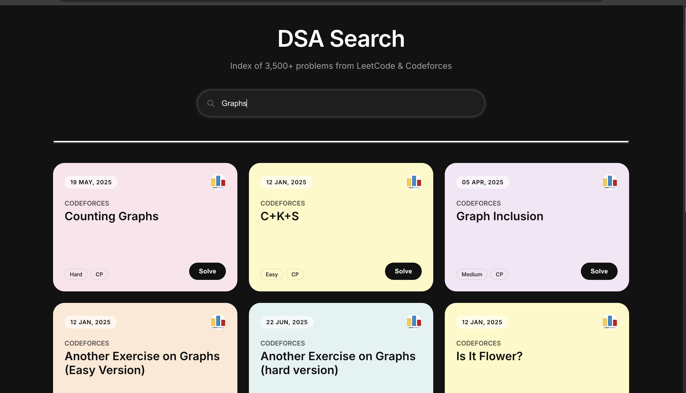

# DSA Search Engine

A vertical search engine for programming problems. This tool aggregates over 3,500 problems from LeetCode and Codeforces into a unified, high-performance search interface.

[View Live Demo](https://dsa-search-engine-5fzb.onrender.com/)



## Overview

The DSA Search Engine addresses the fragmentation in programming resources. It provides a central platform to search for problems across multiple judges instantly.

Unlike standard search tools, this project implements a custom **Vector Space Model** and **Inverted Index** from scratch in Node.js, achieving constant-time O(1) retrieval speeds without relying on external search-as-a-service APIs.

## Key Features

* **Aggregated Search:** Unified corpus merging data from LeetCode and Codeforces.
* **Performance:** Optimized Inverted Index data structure reduces lookup complexity from O(N) to O(1).
* **Custom Ranking:** Implements TF-IDF (Term Frequency-Inverse Document Frequency) to rank results based on query relevance.
* **Resilient Scraping:** Custom Puppeteer scripts handle dynamic content, React hydration, and infinite scrolling.
* **Modern Interface:** Minimalist, responsive dashboard with automatic theme generation.

## Technical Architecture

The system is built to demonstrate the core principles of information retrieval systems.

### 1. Data Ingestion (ETL)
* **Scrapers:** Scripts written in Puppeteer navigate target websites to extract problem titles, URLs, and metadata.
* **Normalization:** Data from different sources is standardized into a common JSON schema.

### 2. Indexing Engine
* **Tokenization:** The `natural` library handles text processing, including stemming and stopword removal.
* **Inverted Index:** On server startup, the system builds an in-memory hash map linking unique tokens to their respective document IDs.
* **Vectorization:** Problems are converted into high-dimensional vectors for similarity calculation.

### 3. Deployment
* **Hosting:** Deployed on Render to maintain a stateful Node.js process, ensuring the index remains in memory for low-latency access.

## Technology Stack

| Component | Technology | Role |
| :--- | :--- | :--- |
| **Runtime** | Node.js | Server-side execution environment |
| **Framework** | Express.js | API routing and middleware |
| **Automation** | Puppeteer | Headless browser for data scraping |
| **NLP** | Natural, Stopword | Text processing and sanitization |
| **Frontend** | Vanilla JS, CSS Grid | Lightweight user interface |

## Local Installation

Follow these steps to set up the project locally.
```bash
1. Clone the repository

git clone https://github.com/SanthoshSanthoju/DSA_Search_Engine.git
cd dsa-search-engine

2. Install dependencies

npm install

3. Build the Corpus The repository includes pre-scraped data. To update the dataset manually:

npm run merge

4. Start the Server

npm start

The application will be available
```
Future Roadmap

Semantic Search: Integration of vector embeddings to enable conceptual search capabilities.

Platform Expansion: Development of scrapers for AtCoder, Geeks for Geeks and CSES.

Persistence: Implementation of local storage for bookmarking problems.